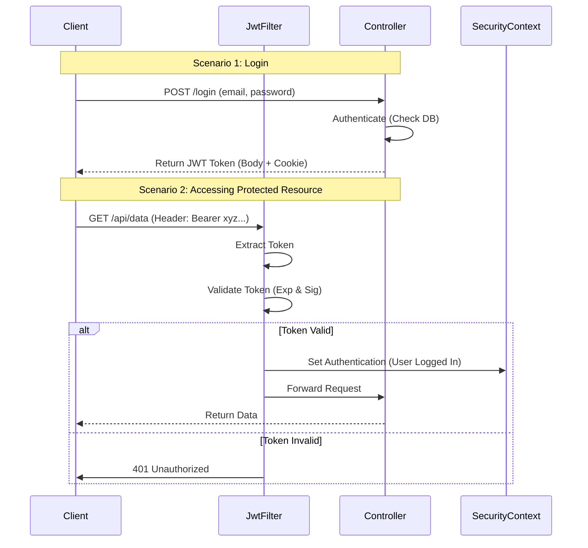

# Backend Security Implementation Guide

This document explains how Spring Security and JWT (JSON Web Tokens) are implemented in your `Authify` project. It is designed to help you answer interview questions by breaking down the concepts and the specific code you used.

## 1. Core Technologies Explained

### **Spring Security**
**What is it?**
Spring Security is a powerful and customizable authentication and access-control framework. It is the de-facto standard for securing Spring-based applications.

**Key Concepts:**
- **Authentication:** Verifying *who* a user is (e.g., checking username/password).
- **Authorization:** Verifying *what* a user is allowed to do (e.g., can they access `/admin`?).
- **Filter Chain:** Spring Security works by intercepting every HTTP request using a chain of filters. Each filter performs a specific security task (e.g., checking headers, handling login).
- **SecurityContext:** A storage area where Spring Security keeps the details of the currently authenticated user for the duration of the request.

---

### **JWT (JSON Web Token)**
**What is it?**
JWT is an open standard (RFC 7519) that defines a compact and self-contained way for securely transmitting information between parties as a JSON object. This information can be verified and trusted because it is digitally signed.

**Structure:**
A JWT looks like `aaaaa.bbbbb.ccccc` and has three parts:
1.  **Header:** The algorithm used (e.g., HS256) and token type.
2.  **Payload:** The data (claims) you want to store (e.g., user email, expiration time).
3.  **Signature:** A hash of the header, payload, and a secret key. This ensures the token hasn't been tampered with.

**Why use it here?**
We use JWT for **Stateless Authentication**. The server does not store user sessions in memory. Instead, the client sends the token with every request. If the token is valid, the server knows who the user is.

---

## 2. File-by-File Implementation Details

Here is how you implemented each part of the security system.

### **1. `SecurityConfig.java`**
**Role:** The "Brain" of your security setup. It configures the rules.

**How you implemented it:**
-   **`@EnableWebSecurity`**: Enables Spring Security's web security support.
-   **`securityFilterChain(HttpSecurity http)`**: Defines the rules for HTTP requests.
    -   **CSRF Disabled:** `csrf(AbstractHttpConfigurer::disable)`. CSRF protection is usually disabled for stateless APIs because we don't use session-based authentication (cookies checks alone aren't the primary auth mechanism).
    -   **Public URLs:** `requestMatchers("/login", "/register", ...).permitAll()` allows anyone to access these endpoints without a token.
    -   **Stateless Session:** `sessionCreationPolicy(SessionCreationPolicy.STATELESS)` tells Spring NOT to create an HTTP session (JSESSIONID). We rely entirely on the token.
    -   **Custom Filter:** `.addFilterBefore(jwtRequestFilter, UsernamePasswordAuthenticationFilter.class)` ensures your `JwtRequestFilter` runs *before* the standard authentication processing. This allows you to log the user in based on their token before Spring tries to check for a username/password form login.
    -   **Exception Handling:** Uses `CustomAuthenticationEntryPoint` to return a proper 401 JSON error instead of a default HTML page when auth fails.

### **2. `JwtUtil.java`**
**Role:** The "Toolbox" for handling tokens.

**How you implemented it:**
-   **`generateJwtToken(UserDetails)`**: Creates a new token.
    -   Uses `Jwts.builder()` to construct the token.
    -   **Subject:** Sets the user's email as the subject.
    -   **Expiration:** Sets the token to expire in 10 hours (`System.currentTimeMillis() + 1000*60*60*10`).
    -   **Signature:** Signs the token with `HS256` and your `SECRET_KEY`.
-   **`extractEmail(token)`**: Parses the token to read the email (subject).
-   **`validateToken(token, userDetails)`**: Checks two things:
    1.  Does the email in the token match the user details provided?
    2.  Is the token expired?

### **3. `JwtRequestFilter.java`**
**Role:** The "Gatekeeper". It checks every single request.

**How you implemented it:**
-   Extends `OncePerRequestFilter`: Guarantees it runs once per request.
-   **Logic Flow:**
    1.  **Skip Public URLs:** If the request is for `/login` or `/register`, it skips logic to avoid overhead.
    2.  **Find Token:** It looks for the JWT in two places:
        -   **Header:** `Authorization: Bearer <token>` (Standard pattern).
        -   **Cookies:** Checks for a cookie named "jwt" (Fallback/Browser convenience).
    3.  **Validate & Authenticate:**
        -   If a token is found and no user is currently authenticated in the `SecurityContext`:
        -   It loads the user from `AppUserDetailsService`.
        -   It calls `jwtUtil.validateToken()`.
        -   **Crucial Step:** If valid, it creates a `UsernamePasswordAuthenticationToken` and places it into `SecurityContextHolder`. This tells Spring Security: *"Trust me, this user is logged in."*

### **4. `AuthController.java`**
**Role:** The "Front Door" for users to get their tokens.

**How you implemented it:**
-   **`/login` Endpoint:**
    1.  Accepts email/password.
    2.  Calls `authenticationManager.authenticate(...)`. This delegates to the `DaoAuthenticationProvider` (configured in `SecurityConfig`) to check the password against the database (BCrypt).
    3.  If successful, generates a JWT using `jwtUtil`.
    4.  **Dual Return:** Returns the token in the JSON body verify *AND* sets it as an `HttpOnly` cookie. This gives the frontend flexibility on how to store it.
-   **`/logout` Endpoint:**
    1.  Clears the `jwt` cookie by setting its age to 0.

### **5. `CustomAuthenticationEntryPoint.java`**
**Role:** The "Bouncer" that handles rejections.

**How you implemented it:**
-   Implemented `AuthenticationEntryPoint`.
-   Overrode `commence(...)` to set the response status to `401 Unauthorized` and write a custom JSON message `{"authenticated": false, ...}`. This ensures your frontend gets a clean JSON error structure instead of a redirect or HTML page.

---

## 3. The Authentication Flow (Interview Explanation)

**"Can you explain the flow of a request in your application?"**

> "Sure. Here is how a request is handled:"

## 4. Common Interview Questions & Answers

**Q: Why do you use `SessionCreationPolicy.STATELESS`?**
**A:** "Because I am using JWT authentication. Restful APIs should ideally be stateless, meaning the server doesn't keep track of user sessions in memory. This makes the application scalable because any server instance can handle a request as long as the token is valid."

**Q: Why do you return the token in an HttpOnly cookie?**
**A:** "It improves security. HttpOnly cookies cannot be accessed by JavaScript running in the browser, which helps protect against Cross-Site Scripting (XSS) attacks where malicious scripts try to steal tokens."

**Q: How does the server know who I am if it's stateless?**
**A:** "The JWT itself contains the user's identity (the 'subject' claim). When the server receives the token, it validates the digital signature to ensure the data hasn't been tampered with, and then simply reads the user identity directly from the token."

**Q: What is the purpose of `daoAuthenticationProvider`?**
**A:** "It is the standard provider in Spring Security that retrieves user details from a `UserDetailsService` (my `AppUserDetailsService`) and validates passwords using a `PasswordEncoder` (my `BCryptPasswordEncoder`)."
